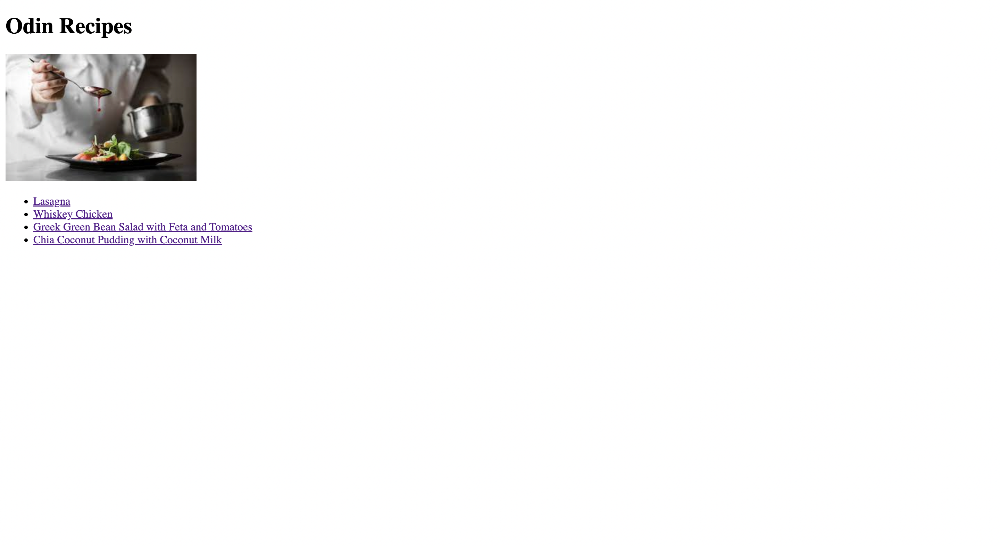

# Recipes
The **Recipes Website** is created with HTML, according to The Odin Project [course](https://www.theodinproject.com/paths/foundations/courses/foundations).  
That's also officially my first web pages I ever built.
 
 

🔗 **Live preview** of the project is [here](https://alex-dishen.github.io/recipes/).

### **Tools:**
* Visual Studio Code
* Linux terminal
* Git and GitHub

### **Outcome:**
* Used **HTML5**
* I learned how to use multiple pages for an application
* Learned how to use links and with there help navigate between pages
* Learned basics of Linux terminal, such as how to create, delete, move, copy files and others
* Learned the difference between Git and GitHub and how to use those tools

### **Links**
* See my next [Project](https://github.com/alex-dishen/landing-page)